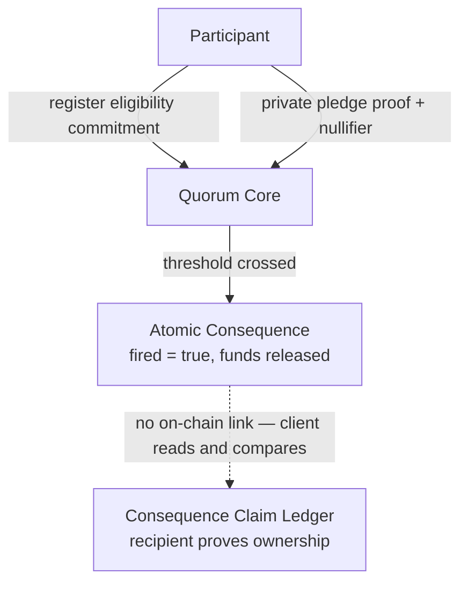
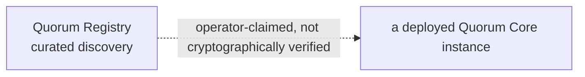

# Silent Quorum

**Prove a threshold was crossed. Never reveal who crossed it first.**


Silent Quorum is an atomic threshold-ignition protocol on
[Midnight](https://midnight.network) for privacy-preserving collective
action — a strike vote, a shareholder revolt, a coordinated disclosure.
Midnight's Compact contracts let a circuit accept a private witness and
prove a fact about it — "this pledge comes from *some* registered
identity" — without that witness ever touching public state. That's
the specific capability the whole mechanism depends on. Participants
prove they're eligible and pledge without revealing *which* registered
identity is theirs. The pledge that crosses the threshold fires the
consequence atomically, in the same transaction — no separate finalize
step, no off-chain keeper.

**Live demo → [silent-quorum.vercel.app](https://silent-quorum.vercel.app)**

All three contracts are implemented, tested, and deployed to the real
Midnight Preprod network today. The sections below say exactly what's
live, what's simulated, and what's been verified — nothing here is
aspirational.

---

## Why Silent Quorum?

Collective action needs a critical mass before anyone can safely act.
The first person to commit is exposed before the group is strong enough
to protect them. If pledge #1 is visible the moment it's made, it can be
targeted — fired, sued, retaliated against — before pledge #2 ever
arrives, and the coalition never reaches critical mass.

A transparent pledge list doesn't just cost participants comfort. It
breaks the mechanism outright. Privacy isn't a feature bolted onto this
protocol afterward; the threshold mechanism *doesn't work* without it.
Silent Quorum's answer: let anyone verify a quorum's eligibility rules
and its progress toward threshold, while keeping every individual
pledge's origin unlinkable to a specific registered identity.

## How it works

Each stage below is one step in a single flow. Steps 2–5 all happen
inside one `pledge()` call — one circuit, one transaction, one proof.

| Stage | What happens | Public | Private |
|---|---|---|---|
| 1. Identity secret | Participant generates a secret locally | — | the secret, forever |
| 2. Eligibility commitment | A hash of the secret is registered on-chain | the commitment (a Merkle leaf) | which participant it belongs to |
| 3. Private pledge proof | Participant proves they hold *some* registered secret | that a valid proof was submitted | which commitment it corresponds to |
| 4. Nullifier | A domain-separated hash prevents double-pledging | the nullifier | the identity that derived it |
| 5. Threshold crossing | The tally increments; contract checks threshold | the running tally | — (tally is not hidden — see Privacy model) |
| 6. Atomic consequence | The crossing pledge fires the consequence in the same transaction | `fired = true`, funds released | — |
| 7. Recipient claim | The named recipient later proves ownership on a separate contract | the claim record | the recipient's own secret |

## The key innovation

**The threshold-crossing pledge is itself the trigger.**

Most threshold-based designs need a second step after the condition is
met — a `finalize()` call, an off-chain keeper watching for the
crossing, a relayer. Silent Quorum has neither. The pledge transaction
that pushes the tally to threshold performs the consequence — releasing
`consequence_balance`, setting `fired = true` — inside that same
transaction, checked and executed by the same circuit that just verified
the pledge itself. There's no window between "threshold reached" and
"consequence executed" for anyone to exploit or for a keeper to fail to
notice.

This isn't just asserted. On a live Midnight devnet, two independently
proved pledge transactions were raced for the same threshold-crossing
slot, submitted 263ms apart: one landed on-chain, the other was
**rejected by the node before inclusion** — never a double-fire, never a
lost pledge. See [ARCHITECTURE.md](ARCHITECTURE.md#live-devnet-results)
for the full transaction trace.

## Architecture

Three contracts, three non-overlapping responsibilities.





| Contract | Responsibility |
|---|---|
| **Quorum Core** | The actual cryptographic protocol: registration, private eligibility proof, pledge, domain-separated nullifier, threshold detection, and atomic consequence firing — all in one circuit. |
| **Quorum Registry** | Curated discovery of deployed Core instances. Intentionally curated, not permissionless — see Limitations. |
| **Consequence Claim Ledger** | Lets the named recipient prove ownership of the recipient commitment and establish a durable public claim record. |

**The architectural boundary that shapes all three:** Compact 0.31.1
has no cross-contract calls and no cross-contract state reads —
confirmed empirically, not assumed (see
[ARCHITECTURE.md](ARCHITECTURE.md#cross-contract-limitation--read-this-before-anything-else)).
So the Claim Ledger can never confirm that a referenced quorum actually
fired, and the Registry can never confirm that its recorded
`configCommitment` matches what a Core instance really has. Every
relationship between these three contracts is two independently-true
facts a client reads and compares — never an on-chain-enforced link.
That boundary is documented, tested, and treated as a permanent design
constraint, not a bug to route around quietly.

## Privacy model

Precision matters more than a single word like "anonymous," so here's
exactly what's private and what isn't.

**Private:**
- Which registered identity produced a given pledge (verified by a
  zero-knowledge membership proof, not by trust).
- The identity secret itself — it never leaves the participant's device.
- The link between a nullifier and the identity that derived it.

**Public, by design:**
- The running pledge count (`tally`). Silent Quorum is **not** a
  hidden-count quorum — anyone can watch a quorum approach threshold.
  Hiding the tally would require a threshold-decryption committee or a
  non-interactive voting scheme; that's open research, not implemented
  here (see [Limitations](#limitations-and-open-research)).
- Every registered eligibility commitment (the Merkle tree is public).
- Every spent nullifier.

**A real, named limitation:** reusing the same identity secret across
two different Core deployments produces byte-identical registration
leaves in both quorums' public trees — an observer comparing the two
trees can tell the same participant registered in both, even though
their *pledges* stay unlinkable (nullifiers are domain-separated by
org/quorum/action; the registration leaf currently isn't). Use a fresh
identity secret per quorum to avoid this.

**Out of scope, stated plainly:** this protocol does not claim
metadata- or network-level anonymity. It says nothing about IP address
correlation, transaction-timing analysis, or wallet-level linkability
outside the identity-commitment scheme above. "Private" here means
what's described in this section — nothing broader should be inferred.

## The live demo

**[silent-quorum.vercel.app](https://silent-quorum.vercel.app)**

The frontend runs two experiences that are never conflated:

| | Simulator | Live · Midnight Preprod |
|---|---|---|
| What it is | The real compiled contracts, executed server-side against an in-memory ledger | The real deployed contracts, read directly from the live Midnight indexer |
| Interaction | Full register / pledge / claim / dispute ritual | Read-only |
| Where | `/console`, `/registry`, `/claims` | `/live` |
| State | Resets on server restart | Genuinely live on-chain state |

**Why `/live` is read-only:** submitting a real Preprod transaction
needs a wallet that has finished syncing its DUST balance — which took
multiple hours per attempt during this project's own deployment (see
[PREPROD_DEPLOYMENT.md](PREPROD_DEPLOYMENT.md#problems-encountered)).
That's incompatible with a web request's lifecycle, so `/live` stays a
genuine, live read of the real deployment instead of faking a
transaction that couldn't safely be submitted from a browser.

## Verified implementation

| What | Result |
|---|---|
| Contract tests | **55 passing**, against the real compiled contracts via `@midnight-ntwrk/compact-runtime`'s local simulator |
| Live-devnet race scenarios | **4** — pledge-vs-pledge, Registry duplicate registration, Claim Ledger duplicate claim, cancel-vs-pledge |
| Contracts deployed to Preprod | **3/3** — Quorum Core, Quorum Registry, Consequence Claim Ledger |
| Preprod deployment checks | **14/14 passed** — 6/6 Core, 4/4 Registry, 4/4 Claim Ledger, each a real transaction accepted or correctly rejected |
| Indexer verification | Every address independently confirmed reachable via the live Preprod indexer, separately from the deploy script's own output |

Full evidence — transaction hashes, exact rejection messages, block
numbers, and the DUST wallet-sync problems encountered along the way —
is in [PREPROD_DEPLOYMENT.md](PREPROD_DEPLOYMENT.md).

## Security / correctness model

| Cryptographically enforced (on-chain, by a circuit) | Client-verified (off-chain, by whoever's using the protocol) |
|---|---|
| Pledge membership (Merkle path + leaf binding) | Registry's `coreAddress` actually hosts the claimed Core instance |
| Nullifier uniqueness — one pledge per identity per quorum | Registry's `configCommitment` matches Core's own `config_commitment` |
| Exactly-once threshold firing | A claim refers to a Core instance that actually fired |
| Issuer / operator / arbiter shared-secret authorization | Real-world settlement of a claimed consequence |
| Recipient-secret ownership for a claim | Whether a threshold was reached "for a good reason" |
| Registry first-write-wins, append-only registration | — |

A claim on the Consequence Claim Ledger proves the claimant knows the
secret behind the commitment they supplied — **it does not, and
structurally cannot, prove the referenced quorum fired.** The Registry
records what an operator *claims* about a Core instance — it does not
cryptographically verify it. Both boundaries are enforced by Compact's
lack of cross-contract reads, not a missing feature.

The full invariant list (22 named properties, each with its
verification status) is in
[ARCHITECTURE.md](ARCHITECTURE.md#security-invariants).

## Limitations and open research

These are deliberate, documented trade-offs — not gaps waiting to be
noticed.

- **The running pledge count is public.** Hiding it needs a
  threshold-decryption committee or a non-interactive voting scheme;
  neither is implemented. Open research, not a silent omission.
- **Issuer / operator / arbiter authorization is a single shared
  secret, not public-key signatures.** No signature-verification API
  exists in Compact 0.31.1 — confirmed empirically. Whoever holds the
  relevant secret has that role's full authority.
- **The Registry is intentionally curated, not permissionless.** A
  decentralized, poison-resistant registry needs multi-party signature
  authorization this toolchain doesn't yet have.
- **No on-chain expiration or deadline exists anywhere.** Compact 0.31.1
  has no trustworthy on-chain clock. Lifecycle (`close_registration`,
  `cancel`) is action-triggered by the issuer, never time-triggered.
- **Registry and Claim Ledger cannot verify Core's state.** The single
  most important architectural fact here — see
  [Architecture](#architecture).
- **Reusing an identity secret across quorums is observably linkable**
  at the registration layer, though not at the pledge layer. Use a
  fresh secret per quorum.
- **Browser-side live transaction submission isn't implemented.**
  Preprod wallet sync currently takes hours, not seconds — unsuitable
  for a web request. The Simulator remains the full interactive
  experience; `/live` remains a genuine read of real chain state.

See [ARCHITECTURE.md](ARCHITECTURE.md#open-research) for the deeper
open-research notes, including an unresolved inclusion-behavior
difference observed in one live-devnet race.

## Repository structure

```
contract/          The three Compact contracts, their compiled output,
                    and the 55-test suite (@midnight-ntwrk/compact-runtime)
web/                Next.js frontend — Simulator + Live · Midnight Preprod
devnet-test/        Live-devnet and Preprod deployment/validation scripts
ARCHITECTURE.md     Full protocol design, invariants, live-devnet evidence
PREPROD_DEPLOYMENT.md  Real Preprod deployment + validation evidence
web/README.md       Frontend architecture and what's actually connected
```

## Running locally

```sh
cd contract
npm install
npm run compact   # compiles all three .compact sources, generates proving keys
npm test          # runs the full 55-test suite against the compiled contracts
```

To run the frontend (npm workspace, from the repository root):

```sh
npm install
npm run --workspace=contract compact
npm run --workspace=contract build
npm run --workspace=web dev
```

Then open `http://localhost:3000`. Live-devnet race reproduction steps
are in [ARCHITECTURE.md](ARCHITECTURE.md#reproducing-it).

## Evidence and documentation

- **[ARCHITECTURE.md](ARCHITECTURE.md)** — full protocol design, the
  cross-contract limitation, all 22 security invariants, and the raw
  live-devnet race transcripts.
- **[PREPROD_DEPLOYMENT.md](PREPROD_DEPLOYMENT.md)** — real Preprod
  deployment evidence: addresses, transaction hashes, exact rejection
  messages, and the problems encountered getting there.
- **[web/README.md](web/README.md)** — what the frontend actually
  connects to, and why real writes stay Simulator-only for now.

## License

Apache License 2.0 — see [LICENSE](LICENSE).

---

Silent Quorum is a working answer to one question: how do you prove a
group crossed a threshold without exposing whoever crossed it first?
Three contracts, 55 tests, real Preprod deployment, and a frontend that
says exactly which parts of it are live.

**[Try it → silent-quorum.vercel.app](https://silent-quorum.vercel.app)**
